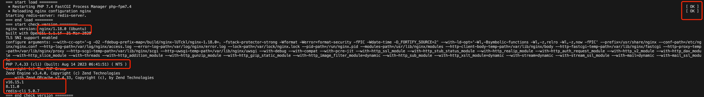

本项目来源于[《腾讯云 Cloud Studio 实战训练营》](https://marketing.csdn.net/p/06a21ca7f4a1843512fa8f8c40a16635)的参赛作品，该作品在腾讯云 [Cloud Studio](https://www.cloudstudio.net/?utm=csdn) 中运行无误。

---

一、系统架构：


技术栈：

- PHP Laravel 5.5
- Mysql 5.7
- Docker、Docker-compose
- Composer
- Node、Npm
- Vue、Webpack
- Redis
- Crontab

---

二、安装shell脚本：

```js
cd dog
# 修改shell执行权限
chmod -R 777 install.sh
```

> 注：在有Press[ENTER]时，注意回车一下


Shell脚本执行完成后，看看是否重启有OK，nginx、php、node、npm、redis等软件显示版本号。



```js
cd DogApi
# 修改缓存文件可执行权限
chmod -R 777 storage
# 安装组件包，注意有几个包比较老，需要输入”Y”升级一下
compose update
```


Docker-compose安装MySQL。
```js
cd dog
chmod -R 777 docker
docker-compose up -d
docker exec -it 容器id env LANG=C.UTF-8 /bin/bash

mysql -u root -p
输入密码
执行dog文件夹下的dbsql.sql文件
```


拉取Vue项目依赖包。


先执行yarn dev，启动内置浏览器，找到公网的临时域名，复制到DogVue下面的.env.development文件中，修改VUE_APP_BASE_API为公网的临时域名。


再将yarn dev关闭，需要重新启动一下。因为修改了配置文件。


再开一个窗口，显示PHP blade模板的预约页面，注意端口为80端口。


---

三、功能说明：

C端预约界面，地址：https://oncapb-qekydi-80.preview.myide.io/reserveH5Show

> 域名 + '/reserveH5Show'


后管功能，密码：kj123.


